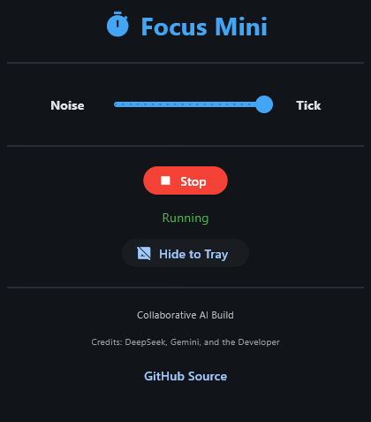

### Update for Focus Mini: [Here](https://github.com/hekawsh/droplets/releases)

# 🎧 Focus Mini

A minimalist desktop timer that blends a steady tick (every 5 seconds) with continuous white noise.  
Adjust the balance to stay aware of time passing – built with Python and Flet.

---

## ✨ Features

- **Adjustable balance** – Drag the slider from 100% Noise to 100% Tick (5% steps)
- **Accurate tick** – Aligned to real‑time seconds (0, 5, 10, …)
- **White noise background** – Smooth, consistent ambience
- **System tray support** – Minimize to tray; restore or exit from the tray icon
- **Spacebar toggle** – Start/stop with a single key press
- **Portable installer** – No admin rights required; installs to `%APPDATA%` and adds shortcuts

---

## 📸 Screenshots



---

## 💾 Download & Install

1. Go to the **[Releases](https://github.com/hekawsh/focusmini/releases)** page.
2. Download `FocusMini_Setup.exe` (the installer).
3. Run the installer – it will copy the app to `%APPDATA%\FocusMini` and create shortcuts on your desktop and Start Menu.
4. Launch Focus Mini from the shortcut.

No Python installation is required.

---

## 🛠️ Build from Source (for developers)

If you want to build the executable yourself or modify the code:

### Prerequisites
- Python 3.7 or higher
- Git (optional)

### Steps

1. Clone the repository:
   ```bash
   git clone https://github.com/hekawsh/focusmini.git
   cd focusmini
   cd focusmini
   ```

2. Install the required Python packages:
   ```bash
   pip install flet sounddevice numpy pystray pywin32 Pillow
   ```

3. (Optional) Create a custom icon:
   ```bash
   python make_icon.py
   ```
   (The `make_icon.py` script is included in the repository.)

4. Build the executable with PyInstaller:
   ```bash
   python -m PyInstaller --onefile --windowed --name "FocusMini" --icon icon.ico --hidden-import sounddevice --hidden-import numpy --hidden-import pystray --hidden-import PIL --collect-data flet focusmini.py
   ```

5. The executable will be located in the `dist` folder.

---

## 🙏 Acknowledgements

- Built with the [Flet](https://flet.dev) framework.
- Audio playback powered by `sounddevice` and `numpy`.
- System tray and icon support from `pystray` and `Pillow`.
- **Code and documentation** generated with the help of [DeepSeek](https://deepseek.com) and Gemini.

---

## 📄 License

This project is licensed under the **MIT License** – see the [LICENSE](LICENSE) file for details.

---
